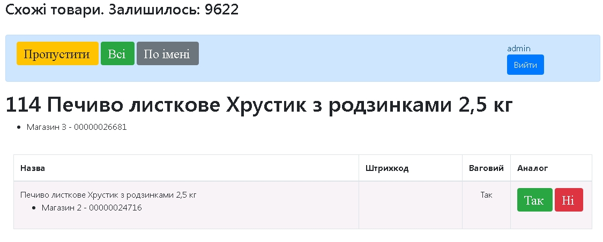
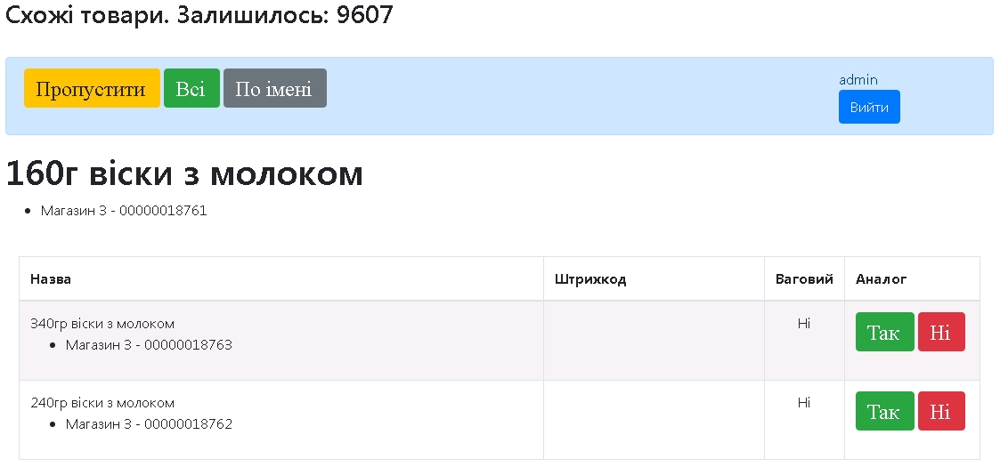

# Застосунок для об'єднання бази товарів декількох магазинів
Вирішення проблеми з об'єднання товарів трьох супермаркетів. Застосунок в процесі розробки та використовується в реальній роботі мережі магазинів.

# Запуск
* Відкорегуйте налаштування підключення до бази даних в src/main/resources/application.properties
* Запустіть src/main/java/ua/gaponov/Main.java. Программа завантажить три файла з даними imperial_1-3.csv. Це займе деякий час.
* Запустіть застосунок на сервері Tomcat та перейдіть за адресою http://localhost:4000/

# Під час першого старту створюється два користувача:
<table>
	<tr>
		<td><b>ім'я</b></td>
		<td><b>пароль</b></td>
	</tr>
    <tr>
		<td>admin</td>
		<td>admin</td>
	</tr>
    <tr>
		<td>user</td>
		<td>user</td>
	</tr>
</table>

# Програма написана з використанням
* Maven
* Java 17 LTS
* Servlets
* JDBC
* MySql
